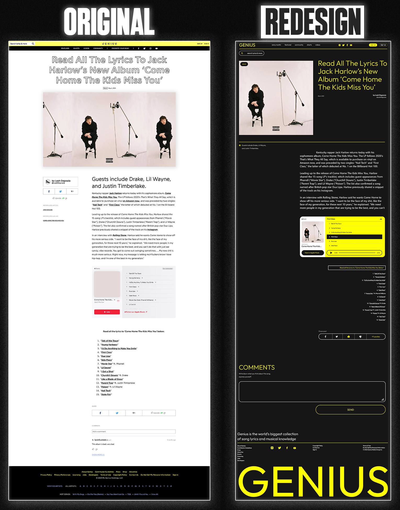

Genius
======

Summary
-------

This is a website I coded using a [redesign of Genius.com by Pavel Korzh](https://www.behance.net/gallery/140483359/GENIUS-website-redesign?tracking_source=search_projects%7Cwebsite)

To check out the live website check visit [ro-genius.netlify.app](https://ro-genius.netlify.app/)

Why Did I Do This? 🤷🏾‍♂️
--------------------------

The main focus in this build for me where the **Homepage** and the **Components** page (where I practised building out the functionalities present throughout Pavel's design). JavaScript was something that scared me a little bit because it felt like there was so much to learn and so many concepts to come to terms with. Whenever I watched tutorials online, I'd be able to follow along just fine but when it came to doing it on my own, often found myself struggling to string together functional code. So, to overcome this fear I forced myself to build what I considered to at the time to be quite complex components, breaking down bigger problem into smaller ones, ultimately demystifying the process of programming.

I made some other parts of the website work too, purely for demonstration purposes, but did so by, for example, using links to articles that already exist on Genius' website, as aforementioned the main focus was creating functional components

Looking Back, What Would I Have Done Differently?🔄
---------------------------------------------------

I was experimenting a little bit in terms of file structuring, and included all my variables in a standalone file called **'new-variables.js'**, however, if I were to re-do the project I probably would've just kept all the variables in their respective files, and only had imports for variables that needed to be accessed across multiple files.

What Are Some Things I Learned In The Course Of Building This? 👨🏾‍💻
----------------------------------------------------------------------

*   How to generate content using JavaScript and a HTML Template.
*   How to make a custom cursor that interacts with elements on the screen.
*   The basics of how to make a carousel.

I also used Adobe XD to re-design the Featured Page on Genius' 2022 website to suit more of the aesthetic that Pavel was going for in his re-design.

### My Featured Page Adobe Re-Design

Skills Used
-----------

*   HTML
*   CSS
*   JavaScript
*   Adobe XD - which I used to redesign the Featured Page on Pavel's Redesign of Genius
*   JSON
*   Git & Github
*   Markdown
